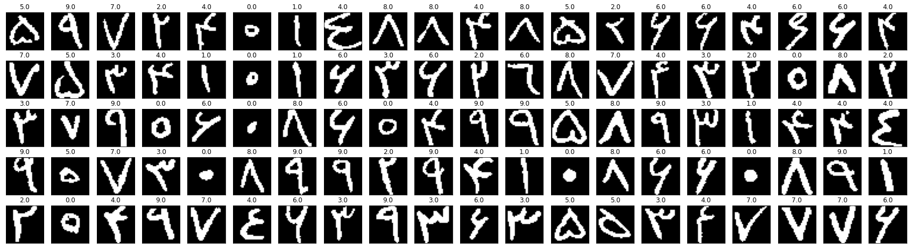

# FarsiDigit-Recognizer

I trained multiple models such as *Gaussian Naive Bayes*, *Logistic Regression*, and *Support Vector Classifier* on [Hoda Dataset](https://github.com/amir-saniyan/HodaDatasetReader) to recognize Farsi digits.\
Hoda dataset is the first dataset of handwritten Farsi digits that has been developed during an MSc. project in Tarbiat Modarres University entitled: Recognizing Farsi Digits and Characters in SANJESH Registration Forms.
The dataset specifications is as follows:

- Resolution of samples: 200 dpi
- Total samples: 102,352 samples
- Training samples: 60,000 samples
- Test samples: 20,000 samples
- Remaining samples: 22,352 samples

Using PCA, I've reduced the number of features from 1024 down to 74. Approximately 80% information of the original data is contained in 74 Principal Components.

Here are the result of the models:
| Model                     | accuracy |
|---------------------------|----------|
| Gaussian Naive Bayes      | 0.83     |
| Logistic Regression       | 0.93     |
| Support Vector Classifier | 0.99     |

